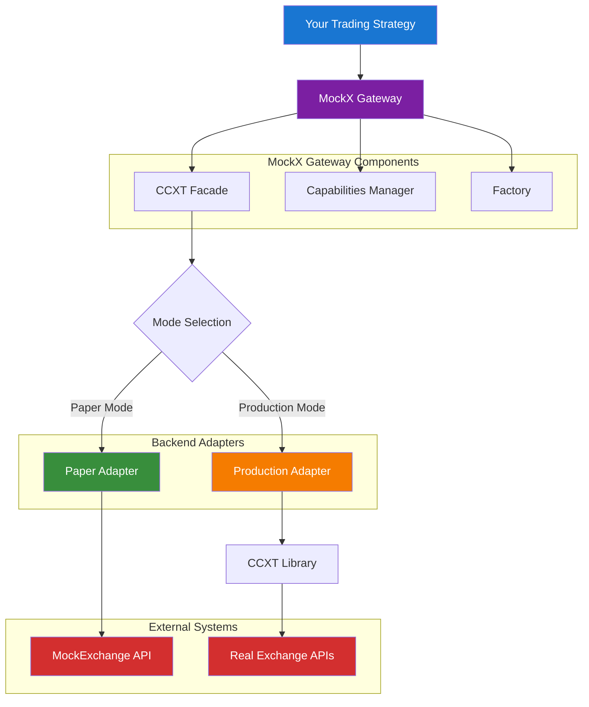

# MockX Gateway

**CCXT-compatible gateway for seamless switching between MockExchange and real exchanges**

[](https://www.python.org/downloads/)
[](https://opensource.org/licenses/MIT)
[](https://github.com/didac-crst/mockexchange-gateway)
[](https://github.com/didac-crst/mockexchange-gateway)
[](https://github.com/didac-crst/mockexchange-gateway)
[](https://github.com/astral-sh/ruff)
[](https://mypy-lang.org/)
[](https://pre-commit.com/)

## 📋 Table of Contents

- [🎯 Overview](#-overview)
- [⚠️ Important: MockExchange Engine Required](#️-important-mockexchange-engine-required)
- [✨ Key Features](#-key-features)
- [🏗️ Architecture](#️-architecture)
- [🧠 Architecture Explained (For Dummies)](#-architecture-explained-for-dummies)
- [🚀 Quick Start](#-quick-start)
- [🎯 Best Practices: Seamless Mode Switching](#-best-practices-seamless-mode-switching)
- [📋 Capabilities Matrix](#-capabilities-matrix)
- [🔧 MockExchange API Compatibility](#-mockexchange-api-compatibility)
- [🔄 Mode Switching Examples](#-mode-switching-examples)
- [🛠️ Development](#️-development)
- [🔧 Advanced Usage](#-advanced-usage)
- [📚 Examples & Use Cases](#-examples--use-cases)
- [🧪 Testing Strategy](#-testing-strategy)
- [🤝 Contributing](#-contributing)
- [📄 License](#-license)
- [🙏 Acknowledgments](#-acknowledgments)

## 🎯 Overview

**MockX Gateway** is part of the **[MockExchange Suite](https://github.com/didac-crst/mockexchange)** - a **drop-in CCXT replacement** that enables seamless switching between:
- **Paper Mode**: MockExchange for deterministic testing
- **Production Mode**: Real exchanges via CCXT for live trading

Write your trading strategies once, test them safely with MockExchange, then deploy to production with zero code changes.

## ⚠️ **Important: MockExchange Engine Required**

**This gateway requires a running MockExchange Engine to function in Paper Mode.** The MockExchange Engine provides the core trading functionality, order matching, and API endpoints that this gateway connects to.

### **Quick Setup with MockExchange Suite:**

```bash
# 1. Clone and start the full MockExchange suite
git clone https://github.com/didac-crst/mockexchange.git
cd mockexchange
make start

# 2. Install and use MockX Gateway
pip install git+https://github.com/didac-crst/mockexchange-gateway.git

# 3. Your gateway will now connect to the running MockExchange Engine
```

**For detailed MockExchange setup instructions, see the [MockExchange Suite documentation](https://github.com/didac-crst/mockexchange).**

## ✨ Key Features

- **🔄 One Flag Switching**: `MOCKX_MODE=paper|prod` controls everything
- **🎯 CCXT Compatibility**: Same API, same method names, same return formats
- **🛡️ Fail Fast**: Unsupported features raise clear `NotSupported` errors
- **📊 Capability Detection**: `exchange.has` dict shows what's available
- **🔧 Environment-Based**: Automatic configuration via environment variables
- **🧪 Type Safe**: Full type hints and validation

## 🏗️ Architecture



## 🧠 Architecture Explained (For Dummies)

The MockX Gateway uses a simple **3-component architecture** that makes it easy to switch between paper trading and live trading:

### **🎭 1. CCXT Facade - "The Universal Translator"**
**What it does**: This is your main interface. It speaks the same language as CCXT, so your trading strategies don't need to change.

**Why it matters**: Whether you're using MockExchange or Binance, you call the same methods (`fetch_ticker()`, `create_order()`, etc.). The facade translates your requests into the right format for whatever exchange you're using.

**Think of it as**: A universal remote control that works with any TV brand.

### **🏭 2. ExchangeFactory - "The Smart Constructor"**
**What it does**: This creates the right gateway for your needs. Tell it "paper mode" or "production mode" and it builds everything correctly.

**Why it matters**: You don't need to worry about the complex setup. Just say what you want, and the factory handles all the technical details.

**Think of it as**: A smart assistant that sets up your entire trading desk based on whether you want to practice or trade for real.

### **🧭 3. Capabilities Manager - "The Safety Guard"**
**What it does**: This tells you what features are available in your current mode. Paper mode has basic features, production mode has everything.

**Why it matters**: Your code can check what's available before trying to use it. No surprises or crashes.

**Think of it as**: A GPS that tells you which roads are open before you start driving.

### **🔄 How They Work Together**

1. **You call the Factory**: `ExchangeFactory.create_paper_gateway()` or `ExchangeFactory.create_prod_gateway()`
2. **Factory creates the Facade**: Sets up the universal interface with the right backend
3. **Facade uses Capabilities**: Knows what features are available and handles requests accordingly
4. **Your code stays the same**: Same methods work in both paper and production modes

### **💡 The Magic**

```python
# This code works identically in both modes:
def my_strategy(gateway):
    ticker = gateway.fetch_ticker("BTC/USDT")  # Same call
    balance = gateway.fetch_balance()          # Same call
    order = gateway.create_order(...)          # Same call
    return order

# Just change how you create the gateway:
paper_gateway = ExchangeFactory.create_paper_gateway(...)    # Practice mode
prod_gateway = ExchangeFactory.create_prod_gateway(...)      # Real money mode

# Your strategy works with both:
my_strategy(paper_gateway)  # Safe testing
my_strategy(prod_gateway)   # Live trading
```

**Result**: Write once, test with MockExchange, deploy to real exchanges. No code changes needed! 🎉

## 🚀 Quick Start

### Installation

> **⚠️ Prerequisite**: This gateway requires a running MockExchange Engine. See the [MockExchange Suite](https://github.com/didac-crst/mockexchange) for setup instructions.

#### 📦 **From GitHub Repository**

```bash
# Clone the repository
git clone https://github.com/didac-crst/mockexchange-gateway.git
cd mockexchange-gateway

# Install with Poetry (recommended)
make install-poetry

# Or install with pip
make install-dev
```

#### 📦 **Using Poetry (Recommended)**

```bash
# Install Poetry first (if not already installed)
curl -sSL https://install.python-poetry.org | python3 -

# Install the package
poetry install

# Or install from PyPI (when published)
poetry add mockexchange-gateway
```

#### 📦 **Using pip (Standard)**

```bash
# Install from GitHub
pip install git+https://github.com/didac-crst/mockexchange-gateway.git

# Or install from PyPI (when published)
pip install mockexchange-gateway
```

### Test & Examples

```bash
# Test basic functionality (no external dependencies)
python examples/test_imports.py

# Run comprehensive examples
make examples
```

### Basic Usage

> **⚠️ Note**: The following example assumes you have a MockExchange Engine running at `http://localhost:8000`. See the [MockExchange Suite](https://github.com/didac-crst/mockexchange) for setup instructions.

```python
from mockexchange_gateway import ExchangeFactory

# Create paper mode gateway (MockExchange)
gateway = ExchangeFactory.create_paper_gateway(
    base_url="http://localhost:8000",
    api_key="your-mockexchange-key"
)

# Same interface works for both modes
ticker = gateway.fetch_ticker("BTC/USDT")
balance = gateway.fetch_balance()
order = gateway.create_order("BTC/USDT", "market", "buy", 0.001)

# Get all available tickers (MockExchange returns all symbols it has)
all_tickers = gateway.fetch_tickers()
print(f"Available symbols: {len(all_tickers)}")

# Get specific tickers
btc_eth_tickers = gateway.fetch_tickers(['BTC/USDT', 'ETH/USDT'])
```

### Production Mode

For live trading with real exchanges:

```python
from mockexchange_gateway import ExchangeFactory

# Production mode (Real Exchange)
gateway = ExchangeFactory.create_prod_gateway(
    exchange_id="binance",  # or 'coinbase', 'kraken', etc.
    api_key="your-api-key",
    secret="your-secret-key",
    sandbox=True  # Use testnet for safety
)

# Same interface - your code works unchanged
ticker = gateway.fetch_ticker("BTC/USDT")
balance = gateway.fetch_balance()
order = gateway.create_order("BTC/USDT", "market", "buy", 0.001)
```

## 🎯 **Best Practices: Seamless Mode Switching**

The key to successful mode switching is writing code that works identically in both paper and production modes. Here are proven patterns to achieve this:

### **1. 📝 Write Exchange-Agnostic Code**

**Goal**: Create functions that work with ANY gateway, regardless of whether it's connected to MockExchange or a real exchange.

**Why this matters**: Your trading logic should be independent of the backend. This allows you to test with MockExchange and deploy to production without changing your strategy code.

```python
def my_trading_strategy(gateway):
    """This function works with ANY exchange (paper or production)."""
    
    # Check capabilities before using features
    if not gateway.has.get("fetchOHLCV", False):
        print("OHLCV not available in this mode")
        return None
    
    # Your trading logic - same for both modes
    ticker = gateway.fetch_ticker("BTC/USDT")
    balance = gateway.fetch_balance()
    
    if ticker["last"] > 50000 and balance["USDT"]["free"] > 100:
        return gateway.create_order("BTC/USDT", "market", "buy", 0.001)
    
    return None
```

### **2. 🔧 Environment-Based Configuration**

**Goal**: Automatically choose the right mode based on your environment (development, staging, production).

**Why this matters**: You don't want to manually change code when moving between environments. This pattern automatically selects paper mode for development and production mode for live trading.

```python
import os
from mockexchange_gateway import ExchangeFactory

def create_gateway_for_environment():
    """Create the right gateway based on environment."""
    
    # Use paper mode for development/testing
    if os.getenv('ENVIRONMENT') in ['development', 'testing']:
        return ExchangeFactory.create_paper_gateway(
            base_url=os.getenv('MOCKX_BASE_URL', 'http://localhost:8000'),
            api_key=os.getenv('MOCKX_API_KEY', 'dev-key')
        )
    
    # Use production mode for live trading
    else:
        return ExchangeFactory.create_prod_gateway(
            exchange_id=os.getenv('EXCHANGE_ID', 'binance'),
            api_key=os.getenv('EXCHANGE_API_KEY'),
            secret=os.getenv('EXCHANGE_SECRET'),
            sandbox=os.getenv('EXCHANGE_SANDBOX', 'true').lower() == 'true'
        )

# Usage - same code works in all environments
gateway = create_gateway_for_environment()
result = my_trading_strategy(gateway)
```

### **3. 🧪 Testing Strategy**

**Goal**: Test your strategies safely in both paper and production modes to ensure they work correctly before going live.

**Why this matters**: You want to catch issues early and verify your strategy behaves the same way in both environments. Paper mode lets you test without risk, while production mode (with testnet) validates real exchange behavior.

```python
def test_strategy_with_paper_mode():
    """Test your strategy safely with MockExchange."""
    
    # Paper mode for testing
    gateway = ExchangeFactory.create_paper_gateway(
        base_url="http://localhost:8000",
        api_key="test-key"
    )
    
    # Test your strategy
    result = my_trading_strategy(gateway)
    
    # Verify behavior without real money
    assert result is not None
    print("Strategy tested successfully in paper mode")

def test_strategy_with_production_mode():
    """Test your strategy with real exchange (testnet)."""
    
    # Production mode with testnet
    gateway = ExchangeFactory.create_prod_gateway(
        exchange_id="binance",
        api_key="your-testnet-key",
        secret="your-testnet-secret",
        sandbox=True  # Use testnet
    )
    
    # Same strategy, real exchange
    result = my_trading_strategy(gateway)
    
    # Verify with real exchange behavior
    assert result is not None
    print("Strategy tested successfully with real exchange")
```

### **4. 🚀 Deployment Workflow**

**Goal**: Create a clear progression from development to production with appropriate testing at each stage.

**Why this matters**: You need confidence that your strategy works correctly before risking real money. This workflow ensures you test thoroughly in each environment before moving to the next.

```python
# development.py - Local development
gateway = ExchangeFactory.create_paper_gateway(
    base_url="http://localhost:8000",
    api_key="dev-key"
)

# staging.py - Pre-production testing
gateway = ExchangeFactory.create_prod_gateway(
    exchange_id="binance",
    api_key="staging-key",
    secret="staging-secret",
    sandbox=True  # Testnet
)

# production.py - Live trading
gateway = ExchangeFactory.create_prod_gateway(
    exchange_id="binance",
    api_key="production-key",
    secret="production-secret",
    sandbox=False  # Live trading
)
```

### **5. 🛡️ Error Handling Best Practices**

**Goal**: Handle errors gracefully so your application doesn't crash when features aren't available or when network issues occur.

**Why this matters**: Different modes have different capabilities, and real exchanges can have temporary issues. Robust error handling ensures your application continues working even when problems arise.

```python
from mockexchange_gateway import NotSupported, ExchangeError

def robust_trading_function(gateway):
    """Handle errors gracefully for both modes."""
    
    try:
        # Check capabilities first
        if not gateway.has.get("fetchOHLCV", False):
            print("OHLCV not available, using alternative method")
            # Use alternative approach
            return None
        
        # Try the operation
        ohlcv = gateway.fetch_ohlcv("BTC/USDT", "1h")
        return ohlcv
        
    except NotSupported as e:
        print(f"Feature not supported in this mode: {e}")
        return None
        
    except ExchangeError as e:
        print(f"Exchange error: {e}")
        return None
        
    except Exception as e:
        print(f"Unexpected error: {e}")
        return None
```

### **6. 📊 Capability Checking**

**Goal**: Adapt your strategy based on what features are available in the current mode, providing fallbacks when advanced features aren't supported.

**Why this matters**: Paper mode has limited features compared to production mode. This pattern allows your strategy to work optimally in both environments by using the best available features.

```python
def adaptive_trading_strategy(gateway):
    """Adapt strategy based on available capabilities."""
    
    strategy = {
        "basic_trading": True,
        "advanced_analysis": False,
        "risk_management": True
    }
    
    # Check what's available
    if gateway.has.get("fetchOHLCV", False):
        strategy["advanced_analysis"] = True
    
    if gateway.has.get("fetchOrderBook", False):
        strategy["order_book_analysis"] = True
    
    # Execute strategy based on capabilities
    if strategy["basic_trading"]:
        return execute_basic_trading(gateway)
    
    if strategy["advanced_analysis"]:
        return execute_advanced_trading(gateway)
    
    return None
```

### **7. 🎯 When to Use MockX Gateway vs CCXT**

**Goal**: Use the right tool for the right job to avoid capability mismatches and maintain clean architecture.

**Why this matters**: MockX Gateway excels at execution, while CCXT is better for data-heavy operations. This separation keeps your app stable and your trading logic deployment-ready.

```python
# Use MockX Gateway for EXECUTION & ACCOUNT operations
# (These are mode-sensitive and benefit from paper/prod switching)
execution_gateway = ExchangeFactory.create_paper_gateway(...)

# Place orders, check balances, track your trades
order = execution_gateway.create_order("BTC/USDT", "market", "buy", 0.001)
balance = execution_gateway.fetch_balance()
my_trades = execution_gateway.fetch_my_trades("BTC/USDT")

# Use CCXT directly for MARKET DATA operations  
# (These are data-heavy and benefit from CCXT's broader surface)
import ccxt
data_exchange = ccxt.binance()

# OHLCV, order books, bulk data
ohlcv = data_exchange.fetch_ohlcv("BTC/USDT", "1h", limit=1000)
orderbook = data_exchange.fetch_order_book("BTC/USDT")
all_tickers = data_exchange.fetch_tickers()
```

**Recommended Split:**
- **MockX Gateway**: `create_order()`, `cancel_order()`, `fetch_balance()`, `fetch_my_trades()`, `fetch_open_orders()`
- **CCXT Direct**: `fetch_ohlcv()`, `fetch_order_book()`, `fetch_trades()`, bulk symbol discovery

**Result**: One-flag swap for execution, full CCXT breadth for analytics, no capability surprises! 🎯


## 📋 Capabilities Matrix

| Feature | Paper Mode | Production Mode |
|---------|------------|-----------------|
| `create_order` | ✅ | ✅ |
| `cancel_order` | ✅ | ✅ |
| `fetch_open_orders` | ✅ | ✅ |
| `fetch_my_trades` | ✅ | ✅ |
| `fetch_balance` | ✅ | ✅ |
| `fetch_balance(asset)` | ✅ | ❌ |
| `fetch_balance_list` | ✅ | ❌ |
| `fetch_ticker` | ✅ | ✅ |
| `fetch_tickers` | ✅ | ✅ |
| `fetch_ohlcv` | ❌ | ✅ |
| `fetch_order_book` | ❌ | ✅ |
| `fetch_trades` | ❌ | ✅ |
| `fetch_positions` | ❌ | ✅ |
| `deposit` | ✅ | ❌ |
| `withdraw` | ✅ | ❌ |
| `can_execute_order` | ✅ | ❌ |

### Capability Detection

```python
gateway = create_paper_gateway(base_url="http://localhost:8000", api_key="dev-key")

# Check what's supported
if gateway.has["fetchOHLCV"]:
    ohlcv = gateway.fetch_ohlcv("BTC/USDT", "1h")
else:
    print("OHLCV not available in this mode")

# Graceful degradation
try:
    order_book = gateway.fetch_order_book("BTC/USDT")
except NotSupported as e:
    print(f"Feature not available: {e}")
```

**Note:** Paper mode includes MockExchange-specific features (deposit, withdraw, etc.) that are not available in production mode. These are clearly documented and don't affect CCXT compatibility.

## 🔧 MockExchange API Compatibility

### Understanding MockExchange's API Behavior

MockExchange has some unique API patterns that differ from standard CCXT exchanges. The gateway handles these differences transparently:

#### **📊 Ticker Data (`fetchTickers`)**

**MockExchange API Behavior:**
- `GET /tickers` → Returns **list of symbol strings** (e.g., `["BTC/USDT", "ETH/USDT", ...]`)
- `GET /tickers/{symbol}` → Returns **ticker data for one symbol**
- `GET /tickers/{symbol1,symbol2,...}` → Returns **ticker data for multiple symbols**

**Gateway Implementation:**
```python
# When no symbols provided, gateway:
# 1. Fetches all available symbols from /tickers
# 2. Uses comma-separated endpoint to get all ticker data
# 3. Returns CCXT-compatible format

all_tickers = gateway.fetch_tickers()  # Returns ALL available tickers (no limit)
specific_tickers = gateway.fetch_tickers(['BTC/USDT', 'ETH/USDT'])  # Returns specific symbols
```

**CCXT Compatibility:**
- ✅ Returns `Dict[str, Dict]` where keys are symbols
- ✅ All standard CCXT ticker fields present
- ✅ No artificial limits (returns all available symbols)
- ✅ Same behavior as real exchanges

#### **📋 Order Status Mapping**

**MockExchange Order Statuses → CCXT Standard Statuses:**
- `"new"` → `"open"` - Order placed, not yet filled
- `"partially_filled"` → `"partially_filled"` - Order partially executed  
- `"filled"` → `"closed"` - Order completely executed
- `"canceled"` → `"canceled"` - Order canceled
- `"expired"` → `"expired"` - Order expired
- `"rejected"` → `"rejected"` - Order rejected
- `"partially_canceled"` → `"canceled"` - Order partially canceled
- `"partially_rejected"` → `"rejected"` - Order partially rejected
- `"partially_expired"` → `"expired"` - Order partially expired

**Gateway Behavior:**
```python
# fetch_open_orders() filters for "new" and "partially_filled" statuses
open_orders = gateway.fetch_open_orders()  # Returns orders with status "open" or "partially_filled"

# fetch_orders() returns all orders with CCXT-standard statuses
all_orders = gateway.fetch_orders()  # Returns orders with mapped CCXT statuses

# Order status is always CCXT-compatible regardless of backend
for order in all_orders:
    print(f"Order {order['id']}: {order['status']}")  # Always CCXT standard status
```

**CCXT Standard Order Statuses:**
- `"open"` - Order is active and waiting to be filled
- `"closed"` - Order is completely filled
- `"canceled"` - Order was canceled
- `"pending"` - Order is pending activation
- `"rejected"` - Order was rejected
- `"expired"` - Order expired
- `"partially_filled"` - Order is partially filled

#### **💰 Balance Operations**

**MockExchange-Specific Features:**
```python
# Standard CCXT balance
balance = gateway.fetch_balance()

# MockExchange-specific operations
balance_list = gateway.fetch_balance_list()  # List of assets with balances
deposit = gateway.deposit("USDT", 1000.0)   # Deposit funds
withdraw = gateway.withdraw("USDT", 500.0)  # Withdraw funds
can_execute = gateway.can_execute_order("BTC/USDT", "market", "buy", 0.001)  # Dry run
```

**Note:** MockExchange-specific methods are clearly documented and not part of standard CCXT.
```

## 🔄 Mode Switching Examples

### Development Workflow

```python
# 1. Development: Use MockExchange
dev_gateway = create_paper_gateway(base_url="http://localhost:8000", api_key="dev-key")

# Test your strategy
dev_gateway.create_order("BTC/USDT", "market", "buy", 0.001)

# 2. Production: Use real exchange
prod_gateway = create_prod_gateway(
    exchange_id="binance",
    api_key="your_key",
    secret="your_secret"
)

# Same code, real trading
prod_gateway.create_order("BTC/USDT", "market", "buy", 0.001)
```

### Strategy Testing

```python
def my_trading_strategy(gateway):
    """This function works with ANY CCXT-compatible exchange."""
    ticker = gateway.fetch_ticker("BTC/USDT")
    balance = gateway.fetch_balance()
    
    if ticker["last"] > 50000 and balance["USDT"]["free"] > 100:
        return gateway.create_order("BTC/USDT", "market", "buy", 0.001)
    return None

# Test with MockExchange
paper_gateway = ExchangeFactory.create_paper_gateway(
    base_url="http://localhost:8000", 
    api_key="dev-key"
)
result = my_trading_strategy(paper_gateway)

# Deploy to production (same code!)
prod_gateway = ExchangeFactory.create_prod_gateway(
    exchange_id="binance", 
    api_key="...", 
    secret="..."
)
result = my_trading_strategy(prod_gateway)
```

## 🛠️ Development

### Setup

```bash
# Clone and setup
git clone https://github.com/didac-crst/mockexchange-gateway.git
cd mockexchange-gateway

# Install with Poetry (recommended)
make install-poetry

# Or install with pip
make install-dev

# Install pre-commit hooks
make install-pre-commit

# Run health checks
make health
```

### Common Commands

```bash
# Code quality
make format      # Format code
make lint        # Run linting
make type-check  # Type checking
make pre-commit  # Run all pre-commit hooks

# Testing
make test        # Run unit tests (CI/CD safe)
make test-integration  # Run integration tests (requires credentials)
make test-all    # Run all tests locally
make test-cov    # Tests with coverage

# Examples
make example     # Run basic usage example

# Build & Publish
make build       # Build package (pip)
make build-poetry # Build package (Poetry)
make publish     # Publish to PyPI (pip)
make publish-poetry # Publish to PyPI (Poetry)

# Development cycle
make dev         # Format + lint + type-check + test
```

### Project Structure

```
mockexchange-gateway/
├── mockexchange_gateway/          # Main package
│   ├── config/                    # Configuration management
│   │   └── symbols.py            # Symbol mapping
│   ├── core/                     # Core functionality
│   │   ├── facade.py             # CCXT-compatible interface
│   │   ├── errors.py             # Error classes
│   │   └── capabilities.py       # Feature detection
│   ├── adapters/                 # Backend adapters
│   │   ├── paper.py              # MockExchange adapter
│   │   ├── prod.py               # CCXT adapter
│   │   └── mapping.py            # Data format conversion
│   └── runtime/                  # Runtime components
│       └── factory.py            # Gateway factory
├── examples/                     # Usage examples
├── tests/                        # Test suite
├── .github/workflows/            # GitHub Actions CI/CD
├── .pre-commit-config.yaml       # Pre-commit hooks
├── Makefile                      # Development tasks
└── README.md                     # This file
```

## 🔧 Advanced Usage

### Custom Symbol Mapping

If MockExchange uses different symbol formats than CCXT:

```json
// symbol_mappings.json
{
  "BTCUSDT": "BTC/USDT",
  "ETHUSDT": "ETH/USDT"
}
```

```bash
export MOCKX_SYMBOL_MAP_PATH=./symbol_mappings.json
```

### Error Handling

```python
from mockexchange_gateway import (
    NotSupported, InsufficientFunds, OrderNotFound
)

try:
    order = gateway.create_order("BTC/USDT", "market", "buy", 1000000)
except InsufficientFunds as e:
    print(f"Insufficient balance: {e}")
except NotSupported as e:
    print(f"Feature not available: {e}")
except OrderNotFound as e:
    print(f"Order not found: {e}")
```

### Context Manager

```python
from mockexchange_gateway import create_paper_gateway

with create_paper_gateway(base_url="http://localhost:8000", api_key="dev-key") as gateway:
    # Gateway automatically closes when done
    ticker = gateway.fetch_ticker("BTC/USDT")
    # ... rest of your code
```

## 📚 Examples & Use Cases

### **Comprehensive Examples**

The `examples/` directory contains complete examples covering all use cases:

| Example | Description | Dependencies | Purpose |
|---------|-------------|--------------|---------|
| **`test_imports.py`** | Verify installation and basic functionality | None | Installation test |
| **`basic_usage.py`** | Paper vs Production mode configuration | MockExchange | Getting started |
| **`error_handling.py`** | Handle NotSupported and other errors gracefully | None | Error handling |
| **`capability_checking.py`** | Check feature availability before using | None | Feature detection |
| **`fetch_ticker.py`** | Get real-time price data | MockExchange | Market data |
| **`place_market_order.py`** | Place trading orders | MockExchange | Trading operations |
| **`list_open_orders.py`** | View pending orders | MockExchange | Order management |

### **Run Examples**

```bash
# Run all examples (some may fail if MockExchange not running)
make examples

# Run individual examples
python examples/test_imports.py      # No dependencies
python examples/error_handling.py    # No dependencies
python examples/capability_checking.py  # No dependencies
python examples/basic_usage.py       # Requires MockExchange
```

### **Example Output**

#### **Successful Paper Mode:**
```
=== Paper Mode Example ===
Gateway mode: Paper
Gateway capabilities: 15 features
Supports createOrder: True
Supports fetchOHLCV: False
Markets loaded: 10 trading pairs
Balance structure: ['info', 'timestamp', 'datetime', 'free', 'used', 'total']
```

#### **Error Handling:**
```
=== Error Handling Example ===
✅ Feature supported: createOrder
❌ Feature not supported: fetchOHLCV
Error: fetchOHLCV not supported in paper mode (MockExchange backend)
```

### **Use Case Examples**

#### **1. Installation Test (No Dependencies)**
```python
from mockexchange_gateway import create_paper_gateway, NotSupported

# Test gateway creation
gateway = create_paper_gateway(base_url="http://localhost:8000", api_key="test-key")
print(f"✅ Gateway created: {gateway}")
print(f"✅ Capabilities: {len(gateway.has)} features")

# Test error handling
try:
    gateway.fetch_ohlcv("BTC/USDT", "1h")
except NotSupported as e:
    print(f"✅ Correctly raised NotSupported: {e}")
```

#### **2. Capability Checking**
```python
# Check what features are available
if gateway.has.get("fetchTicker", False):
    ticker = gateway.fetch_ticker("BTC/USDT")
    print(f"Price: ${ticker.get('last')}")
else:
    print("Ticker not supported in this mode")
```

#### **3. Error Handling**
```python
try:
    order = gateway.create_order("BTC/USDT", "market", "buy", 0.001)
    print(f"Order placed: {order['id']}")
except InsufficientFunds as e:
    print(f"Insufficient balance: {e}")
except NotSupported as e:
    print(f"Feature not available: {e}")
```

## 🧪 Testing Strategy

The project uses a two-tier testing approach:

### **Unit Tests** (CI/CD Safe)
- ✅ **No external dependencies** - Run in GitHub Actions
- ✅ **Fast execution** - Complete in seconds
- ✅ **Reliable** - No network dependencies
- ✅ **Comprehensive** - Test all internal logic

```bash
# Run unit tests (used in CI/CD)
make test
```

### **Integration Tests** (Local Only)
- 🔒 **Require credentials** - Need MockExchange and exchange APIs
- 🌐 **External dependencies** - Network access required
- 💰 **Potential costs** - Real exchange API calls
- 🏠 **Local development** - Run before pushing

```bash
# Run integration tests locally
make test-integration

# Run all tests locally
make test-all
```

### **Why This Separation?**

1. **🔒 Security**: No API credentials in CI/CD
2. **⚡ Speed**: Fast CI/CD pipeline with unit tests only
3. **💰 Cost Control**: No unexpected API charges
4. **🛡️ Reliability**: CI/CD doesn't depend on external services
5. **🧪 Quality**: Integration tests ensure everything works together

### **Pre-Push Checklist**

Before pushing to GitHub, run locally:
```bash
make test-all      # All tests passing
make lint          # Code style clean
make type-check    # Type checking passes
```

## 🤝 Contributing
2. Create a feature branch: `git checkout -b feature/amazing-feature`
3. Make your changes and add tests
4. Run the development cycle: `make dev`
5. Commit your changes: `git commit -m 'Add amazing feature'`
6. Push to the branch: `git push origin feature/amazing-feature`
7. Open a Pull Request

### Development Guidelines

- Follow the existing code style (use `make format`)
- Add type hints to all functions
- Include docstrings for all public methods
- Add tests for new features
- Update documentation as needed

## 📄 License

This project is licensed under the MIT License - see the [LICENSE](LICENSE) file for details.

## 🙏 Acknowledgments

- [CCXT](https://github.com/ccxt/ccxt) - The inspiration and compatibility target

---

**Happy trading! 🚀**

*Remember: Test thoroughly in paper mode before going live.*
