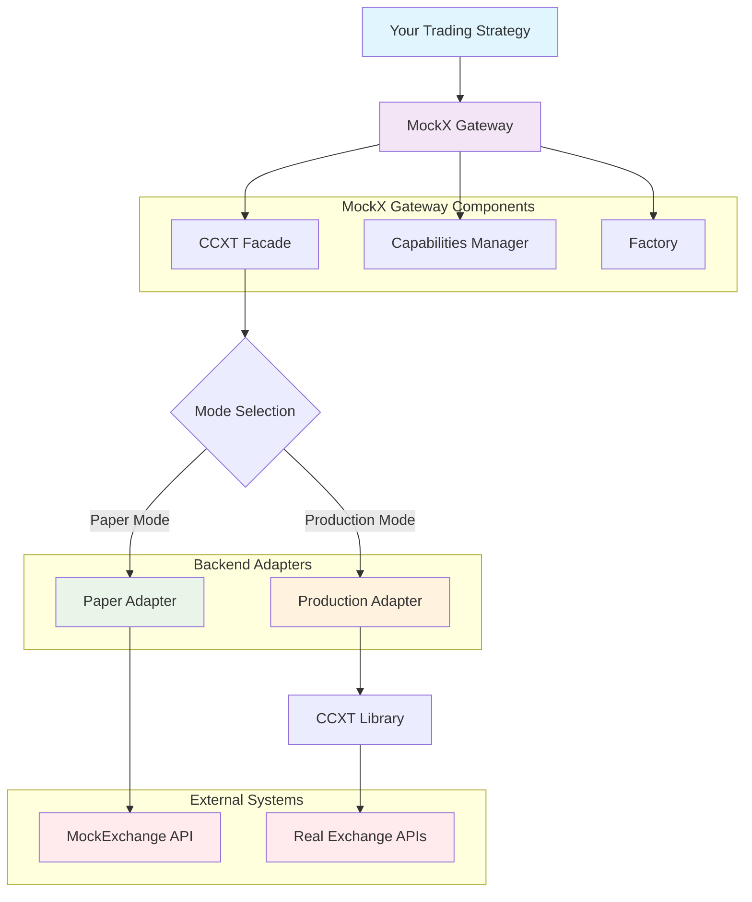

# MockX Gateway

**CCXT-compatible gateway for seamless switching between MockExchange and real exchanges**

[](https://www.python.org/downloads/)
[](https://opensource.org/licenses/MIT)
[](https://github.com/didac-crst/mockexchange-gateway)
[](https://github.com/didac-crst/mockexchange-gateway)
[](https://github.com/didac-crst/mockexchange-gateway)
[](https://github.com/astral-sh/ruff)
[](https://mypy-lang.org/)
[](https://pre-commit.com/)

## 📋 Table of Contents

- [🎯 Overview](#-overview)
- [⚠️ Important: MockExchange Engine Required](#️-important-mockexchange-engine-required)
- [✨ Key Features](#-key-features)
- [🏗️ Architecture](#️-architecture)
- [🚀 Quick Start](#-quick-start)
  - [Installation](#installation)
  - [Test & Examples](#test--examples)
  - [Basic Usage](#basic-usage)
  - [Production Mode](#production-mode)
  - [Using the Factory Class](#using-the-factory-class)
- [⚙️ Configuration](#️-configuration)
  - [Environment Variables](#environment-variables)
  - [Environment-Based Switching](#environment-based-switching)
- [📋 Capabilities Matrix](#-capabilities-matrix)
  - [Capability Detection](#capability-detection)
- [🔧 MockExchange API Compatibility](#-mockexchange-api-compatibility)
  - [Understanding MockExchange's API Behavior](#understanding-mockexchanges-api-behavior)
- [🔄 Mode Switching Examples](#-mode-switching-examples)
  - [Development Workflow](#development-workflow)
  - [Strategy Testing](#strategy-testing)
- [🛠️ Development](#️-development)
  - [Setup](#setup)
  - [Common Commands](#common-commands)
  - [Project Structure](#project-structure)
- [📚 Examples & Use Cases](#-examples--use-cases)
- [🤝 Contributing](#-contributing)
- [📄 License](#-license)

## 🎯 Overview

**MockX Gateway** is part of the **[MockExchange Suite](https://github.com/didac-crst/mockexchange)** - a **drop-in CCXT replacement** that enables seamless switching between:
- **Paper Mode**: MockExchange for deterministic testing
- **Production Mode**: Real exchanges via CCXT for live trading

Write your trading strategies once, test them safely with MockExchange, then deploy to production with zero code changes.

## ⚠️ **Important: MockExchange Engine Required**

**This gateway requires a running MockExchange Engine to function in Paper Mode.** The MockExchange Engine provides the core trading functionality, order matching, and API endpoints that this gateway connects to.

### **Quick Setup with MockExchange Suite:**

```bash
# 1. Clone and start the full MockExchange suite
git clone https://github.com/didac-crst/mockexchange.git
cd mockexchange
make start

# 2. Install and use MockX Gateway
pip install git+https://github.com/didac-crst/mockexchange-gateway.git

# 3. Your gateway will now connect to the running MockExchange Engine
```

**For detailed MockExchange setup instructions, see the [MockExchange Suite documentation](https://github.com/didac-crst/mockexchange).**

## ✨ Key Features

- **🔄 One Flag Switching**: `MOCKX_MODE=paper|prod` controls everything
- **🎯 CCXT Compatibility**: Same API, same method names, same return formats
- **🛡️ Fail Fast**: Unsupported features raise clear `NotSupported` errors
- **📊 Capability Detection**: `exchange.has` dict shows what's available
- **🔧 Environment-Based**: Automatic configuration via environment variables
- **🧪 Type Safe**: Full type hints and validation

## 🏗️ Architecture



## 🚀 Quick Start

### Installation

> **⚠️ Prerequisite**: This gateway requires a running MockExchange Engine. See the [MockExchange Suite](https://github.com/didac-crst/mockexchange) for setup instructions.

#### **📦 **From GitHub Repository**

```bash
# Clone the repository
git clone https://github.com/didac-crst/mockexchange-gateway.git
cd mockexchange-gateway

# Install with Poetry (recommended)
make install-poetry

# Or install with pip
make install-dev
```

#### **📦 **Using Poetry (Recommended)**

```bash
# Install Poetry first (if not already installed)
curl -sSL https://install.python-poetry.org | python3 -

# Install the package
poetry install

# Or install from PyPI (when published)
poetry add mockexchange-gateway
```

#### **📦 **Using pip (Standard)**

```bash
# Install from GitHub
pip install git+https://github.com/didac-crst/mockexchange-gateway.git

# Or install from PyPI (when published)
pip install mockexchange-gateway
```

### Test & Examples

```bash
# Test basic functionality (no external dependencies)
python examples/test_imports.py

# Run comprehensive examples
make examples
```

### Basic Usage

> **⚠️ Note**: The following example assumes you have a MockExchange Engine running at `http://localhost:8000`. See the [MockExchange Suite](https://github.com/didac-crst/mockexchange) for setup instructions.

```python
from mockexchange_gateway import create_paper_gateway

# Create paper mode gateway with explicit configuration
gateway = create_paper_gateway(
    base_url="http://localhost:8000",
    api_key="your-mockexchange-key"
)

# Same interface works for both modes
ticker = gateway.fetch_ticker("BTC/USDT")
balance = gateway.fetch_balance()
order = gateway.create_order("BTC/USDT", "market", "buy", 0.001)

# Get all available tickers (MockExchange returns all 500+ symbols)
all_tickers = gateway.fetch_tickers()
print(f"Available symbols: {len(all_tickers)}")  # Returns ~538 symbols

# Get specific tickers
btc_eth_tickers = gateway.fetch_tickers(['BTC/USDT', 'ETH/USDT'])
```

### Production Mode

For live trading with real exchanges:

```python
from mockexchange_gateway import create_prod_gateway

# Production mode (Real Exchange)
prod_gateway = create_prod_gateway(
    exchange_id="binance",  # or 'coinbase', 'kraken', etc.
    api_key="your-api-key",
    secret="your-secret-key",
    sandbox=True  # Use testnet for safety
)
```

### Using the Factory Class

For more advanced use cases:

```python
from mockexchange_gateway import MockXFactory

# Create paper mode gateway
paper_gateway = MockXFactory.create_paper_gateway(
    base_url="http://localhost:8000",
    api_key="dev-key"
)

# Create production mode gateway
prod_gateway = MockXFactory.create_prod_gateway(
    exchange_id="coinbase",  # or 'binance', 'kraken', etc.
    api_key="your-exchange-key",
    secret="your-exchange-secret"
)
```

## ⚙️ Configuration

### Environment Variables

Copy `env.example` to `.env` and customize:

```bash
# Mode configuration
MOCKX_MODE=paper                    # paper | prod
MOCKX_EXCHANGE_ID=binance          # Only for prod mode

# Paper mode (MockExchange)
MOCKX_BASE_URL=http://localhost:8000
MOCKX_API_KEY=dev-key
MOCKX_TIMEOUT=10.0

# Production mode (Real exchanges)
BINANCE_API_KEY=your_api_key       # {EXCHANGE_ID}_API_KEY
BINANCE_API_SECRET=your_secret     # {EXCHANGE_ID}_API_SECRET
MOCKX_SANDBOX=false                # true for testnet
```

### Environment-Based Switching

```python
import os
from mockexchange_gateway import create_paper_gateway, create_prod_gateway

# Automatically choose based on environment
use_mock = os.getenv('ENVIRONMENT') != 'production'

if use_mock:
    gateway = create_paper_gateway(base_url="http://localhost:8000", api_key="dev-key")
else:
    gateway = create_prod_gateway(
        exchange_id="binance",
        api_key=os.getenv('EXCHANGE_API_KEY'),
        secret=os.getenv('EXCHANGE_SECRET')
    )
# Your code works the same regardless of mode
```

## 📋 Capabilities Matrix

| Feature | Paper Mode | Production Mode |
|---------|------------|-----------------|
| `create_order` | ✅ | ✅ |
| `cancel_order` | ✅ | ✅ |
| `fetch_open_orders` | ✅ | ✅ |
| `fetch_my_trades` | ✅ | ✅ |
| `fetch_balance` | ✅ | ✅ |
| `fetch_balance(asset)` | ✅ | ❌ |
| `fetch_balance_list` | ✅ | ❌ |
| `fetch_ticker` | ✅ | ✅ |
| `fetch_tickers` | ✅ | ✅ |
| `fetch_ohlcv` | ❌ | ✅ |
| `fetch_order_book` | ❌ | ✅ |
| `fetch_trades` | ❌ | ✅ |
| `fetch_positions` | ❌ | ✅ |
| `deposit` | ✅ | ❌ |
| `withdraw` | ✅ | ❌ |
| `can_execute_order` | ✅ | ❌ |

### Capability Detection

```python
gateway = create_paper_gateway(base_url="http://localhost:8000", api_key="dev-key")

# Check what's supported
if gateway.has["fetchOHLCV"]:
    ohlcv = gateway.fetch_ohlcv("BTC/USDT", "1h")
else:
    print("OHLCV not available in this mode")

# Graceful degradation
try:
    order_book = gateway.fetch_order_book("BTC/USDT")
except NotSupported as e:
    print(f"Feature not available: {e}")
```

**Note:** Paper mode includes MockExchange-specific features (deposit, withdraw, etc.) that are not available in production mode. These are clearly documented and don't affect CCXT compatibility.

## 🔧 MockExchange API Compatibility

### Understanding MockExchange's API Behavior

MockExchange has some unique API patterns that differ from standard CCXT exchanges. The gateway handles these differences transparently:

#### **📊 Ticker Data (`fetchTickers`)**

**MockExchange API Behavior:**
- `GET /tickers` → Returns **list of symbol strings** (e.g., `["BTC/USDT", "ETH/USDT", ...]`)
- `GET /tickers/{symbol}` → Returns **ticker data for one symbol**
- `GET /tickers/{symbol1,symbol2,...}` → Returns **ticker data for multiple symbols**

**Gateway Implementation:**
```python
# When no symbols provided, gateway:
# 1. Fetches all available symbols from /tickers
# 2. Uses comma-separated endpoint to get all ticker data
# 3. Returns CCXT-compatible format

all_tickers = gateway.fetch_tickers()  # Returns ALL available tickers (no limit)
specific_tickers = gateway.fetch_tickers(['BTC/USDT', 'ETH/USDT'])  # Returns specific symbols
```

**CCXT Compatibility:**
- ✅ Returns `Dict[str, Dict]` where keys are symbols
- ✅ All standard CCXT ticker fields present
- ✅ No artificial limits (returns all available symbols)
- ✅ Same behavior as real exchanges

#### **📋 Order Status Mapping**

**MockExchange Order Statuses:**
- `"new"` - Order placed, not yet filled
- `"partially_filled"` - Order partially executed
- `"filled"` - Order completely executed
- `"canceled"` - Order canceled
- `"expired"` - Order expired
- `"rejected"` - Order rejected
- `"partially_canceled"` - Order partially canceled
- `"partially_rejected"` - Order partially rejected
- `"partially_expired"` - Order partially expired

**Gateway Mapping:**
```python
# fetch_open_orders() filters for "new" and "partially_filled" statuses
open_orders = gateway.fetch_open_orders()  # Only returns truly open orders

# fetch_orders() returns all orders with all statuses
all_orders = gateway.fetch_orders()  # Returns orders in any status
```

#### **💰 Balance Operations**

**MockExchange-Specific Features:**
```python
# Standard CCXT balance
balance = gateway.fetch_balance()

# MockExchange-specific operations
balance_list = gateway.fetch_balance_list()  # List of assets with balances
deposit = gateway.deposit("USDT", 1000.0)   # Deposit funds
withdraw = gateway.withdraw("USDT", 500.0)  # Withdraw funds
can_execute = gateway.can_execute_order("BTC/USDT", "market", "buy", 0.001)  # Dry run
```

**Note:** MockExchange-specific methods are clearly documented and not part of standard CCXT.
```

## 🔄 Mode Switching Examples

### Development Workflow

```python
# 1. Development: Use MockExchange
dev_gateway = create_paper_gateway(base_url="http://localhost:8000", api_key="dev-key")

# Test your strategy
dev_gateway.create_order("BTC/USDT", "market", "buy", 0.001)

# 2. Production: Use real exchange
prod_gateway = create_prod_gateway(
    exchange_id="binance",
    api_key="your_key",
    secret="your_secret"
)

# Same code, real trading
prod_gateway.create_order("BTC/USDT", "market", "buy", 0.001)
```

### Strategy Testing

```python
def my_trading_strategy(gateway):
    """This function works with ANY CCXT-compatible exchange."""
    ticker = gateway.fetch_ticker("BTC/USDT")
    balance = gateway.fetch_balance()
    
    if ticker["last"] > 50000 and balance["USDT"]["free"] > 100:
        return gateway.create_order("BTC/USDT", "market", "buy", 0.001)
    return None

# Test with MockExchange
paper_gateway = create_paper_gateway(base_url="http://localhost:8000", api_key="dev-key")
result = my_trading_strategy(paper_gateway)

# Deploy to production (same code!)
prod_gateway = create_prod_gateway("binance", api_key="...", secret="...")
result = my_trading_strategy(prod_gateway)
```

## 🛠️ Development

### Setup

```bash
# Clone and setup
git clone https://github.com/didac-crst/mockexchange-gateway.git
cd mockexchange-gateway

# Install with Poetry (recommended)
make install-poetry

# Or install with pip
make install-dev

# Install pre-commit hooks
make install-pre-commit

# Run health checks
make health
```

### Common Commands

```bash
# Code quality
make format      # Format code
make lint        # Run linting
make type-check  # Type checking
make pre-commit  # Run all pre-commit hooks

# Testing
make test        # Run unit tests (CI/CD safe)
make test-integration  # Run integration tests (requires credentials)
make test-all    # Run all tests locally
make test-cov    # Tests with coverage

# Examples
make example     # Run basic usage example

# Build & Publish
make build       # Build package (pip)
make build-poetry # Build package (Poetry)
make publish     # Publish to PyPI (pip)
make publish-poetry # Publish to PyPI (Poetry)

# Development cycle
make dev         # Format + lint + type-check + test
```

### Project Structure

```
mockexchange-gateway/
├── mockexchange_gateway/          # Main package
│   ├── config/                    # Configuration management
│   │   └── symbols.py            # Symbol mapping
│   ├── core/                     # Core functionality
│   │   ├── facade.py             # CCXT-compatible interface
│   │   ├── errors.py             # Error classes
│   │   └── capabilities.py       # Feature detection
│   ├── adapters/                 # Backend adapters
│   │   ├── paper.py              # MockExchange adapter
│   │   ├── prod.py               # CCXT adapter
│   │   └── mapping.py            # Data format conversion
│   └── runtime/                  # Runtime components
│       └── factory.py            # Gateway factory
├── examples/                     # Usage examples
├── tests/                        # Test suite
├── .github/workflows/            # GitHub Actions CI/CD
├── .pre-commit-config.yaml       # Pre-commit hooks
├── Makefile                      # Development tasks
└── README.md                     # This file
```

## 🔧 Advanced Usage

### Custom Symbol Mapping

If MockExchange uses different symbol formats than CCXT:

```json
// symbol_mappings.json
{
  "BTCUSDT": "BTC/USDT",
  "ETHUSDT": "ETH/USDT"
}
```

```bash
export MOCKX_SYMBOL_MAP_PATH=./symbol_mappings.json
```

### Error Handling

```python
from mockexchange_gateway import (
    NotSupported, InsufficientFunds, OrderNotFound
)

try:
    order = gateway.create_order("BTC/USDT", "market", "buy", 1000000)
except InsufficientFunds as e:
    print(f"Insufficient balance: {e}")
except NotSupported as e:
    print(f"Feature not available: {e}")
except OrderNotFound as e:
    print(f"Order not found: {e}")
```

### Context Manager

```python
from mockexchange_gateway import create_paper_gateway

with create_paper_gateway(base_url="http://localhost:8000", api_key="dev-key") as gateway:
    # Gateway automatically closes when done
    ticker = gateway.fetch_ticker("BTC/USDT")
    # ... rest of your code
```

## 📚 Examples & Use Cases

### **Comprehensive Examples**

The `examples/` directory contains complete examples covering all use cases:

| Example | Description | Dependencies | Purpose |
|---------|-------------|--------------|---------|
| **`test_imports.py`** | Verify installation and basic functionality | None | Installation test |
| **`basic_usage.py`** | Paper vs Production mode configuration | MockExchange | Getting started |
| **`error_handling.py`** | Handle NotSupported and other errors gracefully | None | Error handling |
| **`capability_checking.py`** | Check feature availability before using | None | Feature detection |
| **`fetch_ticker.py`** | Get real-time price data | MockExchange | Market data |
| **`place_market_order.py`** | Place trading orders | MockExchange | Trading operations |
| **`list_open_orders.py`** | View pending orders | MockExchange | Order management |

### **Run Examples**

```bash
# Run all examples (some may fail if MockExchange not running)
make examples

# Run individual examples
python examples/test_imports.py      # No dependencies
python examples/error_handling.py    # No dependencies
python examples/capability_checking.py  # No dependencies
python examples/basic_usage.py       # Requires MockExchange
```

### **Example Output**

#### **Successful Paper Mode:**
```
=== Paper Mode Example ===
Gateway mode: Paper
Gateway capabilities: 15 features
Supports createOrder: True
Supports fetchOHLCV: False
Markets loaded: 10 trading pairs
Balance structure: ['info', 'timestamp', 'datetime', 'free', 'used', 'total']
```

#### **Error Handling:**
```
=== Error Handling Example ===
✅ Feature supported: createOrder
❌ Feature not supported: fetchOHLCV
Error: fetchOHLCV not supported in paper mode (MockExchange backend)
```

### **Use Case Examples**

#### **1. Installation Test (No Dependencies)**
```python
from mockexchange_gateway import create_paper_gateway, NotSupported

# Test gateway creation
gateway = create_paper_gateway(base_url="http://localhost:8000", api_key="test-key")
print(f"✅ Gateway created: {gateway}")
print(f"✅ Capabilities: {len(gateway.has)} features")

# Test error handling
try:
    gateway.fetch_ohlcv("BTC/USDT", "1h")
except NotSupported as e:
    print(f"✅ Correctly raised NotSupported: {e}")
```

#### **2. Capability Checking**
```python
# Check what features are available
if gateway.has.get("fetchTicker", False):
    ticker = gateway.fetch_ticker("BTC/USDT")
    print(f"Price: ${ticker.get('last')}")
else:
    print("Ticker not supported in this mode")
```

#### **3. Error Handling**
```python
try:
    order = gateway.create_order("BTC/USDT", "market", "buy", 0.001)
    print(f"Order placed: {order['id']}")
except InsufficientFunds as e:
    print(f"Insufficient balance: {e}")
except NotSupported as e:
    print(f"Feature not available: {e}")
```

## 🧪 Testing Strategy

The project uses a two-tier testing approach:

### **Unit Tests** (CI/CD Safe)
- ✅ **No external dependencies** - Run in GitHub Actions
- ✅ **Fast execution** - Complete in seconds
- ✅ **Reliable** - No network dependencies
- ✅ **Comprehensive** - Test all internal logic

```bash
# Run unit tests (used in CI/CD)
make test
```

### **Integration Tests** (Local Only)
- 🔒 **Require credentials** - Need MockExchange and exchange APIs
- 🌐 **External dependencies** - Network access required
- 💰 **Potential costs** - Real exchange API calls
- 🏠 **Local development** - Run before pushing

```bash
# Run integration tests locally
make test-integration

# Run all tests locally
make test-all
```

### **Why This Separation?**

1. **🔒 Security**: No API credentials in CI/CD
2. **⚡ Speed**: Fast CI/CD pipeline with unit tests only
3. **💰 Cost Control**: No unexpected API charges
4. **🛡️ Reliability**: CI/CD doesn't depend on external services
5. **🧪 Quality**: Integration tests ensure everything works together

### **Pre-Push Checklist**

Before pushing to GitHub, run locally:
```bash
make test-all      # All tests passing
make lint          # Code style clean
make type-check    # Type checking passes
```

## 🤝 Contributing
2. Create a feature branch: `git checkout -b feature/amazing-feature`
3. Make your changes and add tests
4. Run the development cycle: `make dev`
5. Commit your changes: `git commit -m 'Add amazing feature'`
6. Push to the branch: `git push origin feature/amazing-feature`
7. Open a Pull Request

### Development Guidelines

- Follow the existing code style (use `make format`)
- Add type hints to all functions
- Include docstrings for all public methods
- Add tests for new features
- Update documentation as needed

## 📄 License

This project is licensed under the MIT License - see the [LICENSE](LICENSE) file for details.

## 🙏 Acknowledgments

- [CCXT](https://github.com/ccxt/ccxt) - The inspiration and compatibility target
- [MockExchange](https://github.com/didac-crst/mockexchange) - The paper trading backend

## 📞 Support

- **Issues**: [GitHub Issues](https://github.com/didac-crst/mockexchange-gateway/issues)
- **Discussions**: [GitHub Discussions](https://github.com/didac-crst/mockexchange-gateway/discussions)
- **Documentation**: [README](README.md) and inline docstrings

---

**Happy trading! 🚀**

*Remember: Test thoroughly in paper mode before going live.*
